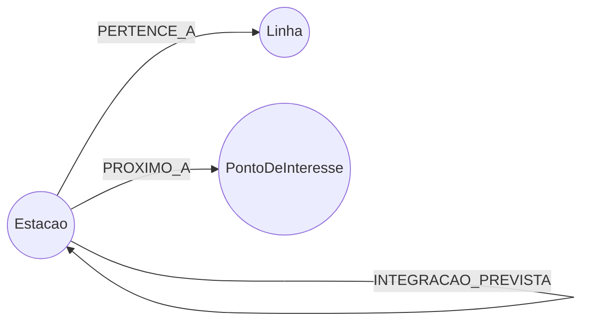

# Grafo da Malha Metroferroviária de São Paulo (Neo4j)

Modelo de grafo (Neo4j/Cypher) da rede de Metrô + CPTM de São Paulo, criado para demonstrar o potencial de bancos de dados em grafo em um problema real de mobilidade urbana: menor rota, rota mais eficiente, pontos turísticos e simulações de resiliência de rede ("o que acontece se eu fechar tal estação/linha?").

## Por que grafo

Uma malha de transporte é, por natureza, uma rede de nós (estações) e arestas (trechos). Perguntas como "qual a menor rota", "qual a rota mais rápida" ou "o que acontece se essa linha fechar" são, matematicamente, buscas de caminho mínimo e análises de conectividade em grafo. Em SQL, isso normalmente exige *joins* recursivos custosos e uma consulta nova para cada cenário. Em Cypher é uma travessia nativa — o mesmo padrão de consulta resolve interdição de uma linha ou "quais pontos turísticos dá para visitar com no máximo 2 baldeações", apenas trocando o filtro.

## Modelo de dados

| Nó | Propriedades principais | Descrição |
|---|---|---|
| `Estacao` | `nome` (única), `municipio`, `aeroporto` | Estação física. Estações com o mesmo nome em linhas diferentes são o **mesmo nó** — um hub de integração (ex.: Sé) aparece naturalmente com várias linhas conectadas. |
| `Linha` | `id` (única), `numero`, `nome`, `cor`, `tipo`, `operadora` | Linha da rede (metrô, monotrilho ou trem). |
| `PontoDeInteresse` | `nome` (única), `categoria`, `descricao` | Ponto turístico/cultural/lazer da cidade. |

| Relacionamento | Sentido | Descrição |
|---|---|---|
| `PERTENCE_A` | `(Estacao)->(Linha)` | Posição da estação na sequência da linha (`ordem`). |
| `CONECTA` | `(Estacao)->(Estacao)` | Trecho direto entre estações consecutivas (`linha`, `distancia_km`, `tempo_min`). Tratado como não-direcionado nas consultas. |
| `INTEGRACAO_PREVISTA` | `(Estacao)->(Estacao)` | Integração física planejada mas ainda não operacional (ex.: Água Branca da Linha 6). |
| `PROXIMO_A` | `(Estacao)->(PontoDeInteresse)` | Proximidade a pé (`distancia_m`, `tempo_caminhada_min`). |

**Escala:** 15 linhas · 150 estações únicas · 160 trechos diretos · 22 pontos de interesse.

## Fontes e metodologia

Dados de linhas e estações levantados via busca na web em julho de 2026 (Metrô SP, CPTM, Metrô CPTM, Agência Brasil).

## Limitações e avisos importantes

- **Tempo e distância dos trechos são estimativas ilustrativas**, calculadas a partir da extensão oficial da linha (quando conhecida) e de velocidades comerciais médias por modal — não são o horário oficial de nenhuma concessionária.
- Este é um projeto de demonstração, não um app de navegação — para informações de viagem reais, use os canais oficiais do Metrô/CPTM.
