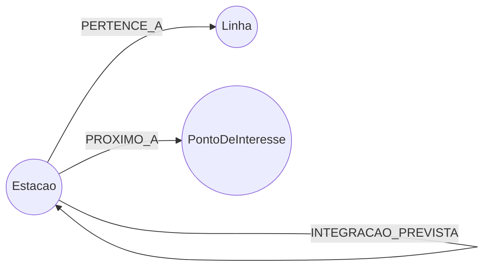

# Grafo da Malha Metroferroviária de São Paulo (Neo4j)

Modelo de grafo (Neo4j/Cypher) da rede de Metrô + CPTM de São Paulo, criado para demonstrar o potencial de bancos de dados em grafo em um problema real de mobilidade urbana: menor rota, rota mais eficiente, pontos turísticos e simulações de resiliência de rede ("o que acontece se eu fechar tal estação/linha?").

> **Descrição curta (para o campo "About" do repositório):**
> Modelo de grafo (Neo4j) da malha de metrô/trem de São Paulo — rotas, pontos turísticos e simulações de fechamento de estações/linhas, demonstrando na prática o poder de grafos em mobilidade urbana.

## Índice

- [Por que grafo](#por-que-grafo)
- [Modelo de dados](#modelo-de-dados)
- [Estrutura do repositório](#estrutura-do-repositório)
- [Pré-requisitos](#pré-requisitos)
- [Como rodar](#como-rodar)
- [Destaques (o que vale mostrar em uma demo)](#destaques-o-que-vale-mostrar-em-uma-demo)
- [Fontes e metodologia](#fontes-e-metodologia)
- [Limitações e avisos importantes](#limitações-e-avisos-importantes)

## Por que grafo

Uma malha de transporte é, por natureza, uma rede de nós (estações) e arestas (trechos). Perguntas como "qual a menor rota", "qual a rota mais rápida" ou "o que acontece se essa linha fechar" são, matematicamente, buscas de caminho mínimo e análises de conectividade em grafo. Em SQL, isso normalmente exige *joins* recursivos custosos e uma consulta nova para cada cenário. Em Cypher é uma travessia nativa — o mesmo padrão de consulta resolve interdição de uma linha ou "quais pontos turísticos dá para visitar com no máximo 2 baldeações", apenas trocando o filtro.

## Modelo de dados



| Nó | Propriedades principais | Descrição |
|---|---|---|
| `Estacao` | `nome` (única), `municipio`, `aeroporto` | Estação física. Estações com o mesmo nome em linhas diferentes são o **mesmo nó** — um hub de integração (ex.: Sé) aparece naturalmente com várias linhas conectadas. |
| `Linha` | `id` (única), `numero`, `nome`, `cor`, `tipo`, `operadora` | Linha da rede (metrô, monotrilho ou trem). |
| `PontoDeInteresse` | `nome` (única), `categoria`, `descricao` | Ponto turístico/cultural/lazer da cidade. |

| Relacionamento | Sentido | Descrição |
|---|---|---|
| `PERTENCE_A` | `(Estacao)->(Linha)` | Posição da estação na sequência da linha (`ordem`). |
| `CONECTA` | `(Estacao)->(Estacao)` | Trecho direto entre estações consecutivas (`linha`, `distancia_km`, `tempo_min`). Tratado como não-direcionado nas consultas. |
| `INTEGRACAO_PREVISTA` | `(Estacao)->(Estacao)` | Integração física planejada mas ainda não operacional (ex.: Água Branca da Linha 6). |
| `PROXIMO_A` | `(Estacao)->(PontoDeInteresse)` | Proximidade a pé (`distancia_m`, `tempo_caminhada_min`). |

**Escala:** 15 linhas · 150 estações únicas · 160 trechos diretos · 22 pontos de interesse.

## Estrutura do repositório

```
.
├── modelo_grafo_metro_sp.md        # Documentação completa: pesquisa, modelo, metodologia
├── carga_grafo_metro_sp.cypher     # 1. Carga da malha: linhas + estações + trechos
├── carga_pontos_interesse.cypher   # 2. Carga dos pontos turísticos (opcional)
├── consultas_exemplo.cypher        # Consultas de rota e de pontos turísticos
└── exemplos_e_simulacoes.cypher    # Rotas + simulações de fechamento de estação/linha
```

Os arquivos `carga_*` são scripts de **carga** (idempotentes, usam `MERGE`); `consultas_exemplo.cypher` e `exemplos_e_simulacoes.cypher` são baterias de **consultas prontas** para explorar o grafo depois de carregado.


## Como rodar

1. Abra o Neo4j Browser (ou `cypher-shell`) conectado a um banco vazio.
2. Execute, nesta ordem:
   ```
   carga_grafo_metro_sp.cypher
   carga_pontos_interesse.cypher      (opcional)
   ```
3. Rode as consultas de `consultas_exemplo.cypher` e/ou `exemplos_e_simulacoes.cypher` uma de cada vez para explorar o grafo.

## Destaques (o que vale mostrar em uma demo)

- **Menor caminho ≠ mais rápido.** Compare a consulta de menor número de estações com a de menor tempo (Dijkstra) para o mesmo par origem/destino — frequentemente são rotas diferentes.
- **Simulações de resiliência.** Fechar uma estação comum vs. fechar um hub tem impactos muito diferentes; fechar uma linha inteira pode isolar totalmente um grupo de estações — tudo isso em `exemplos_e_simulacoes.cypher`, incluindo um ranking "artesanal" de estações mais críticas sem precisar do plugin GDS.
- **Planejamento de rede.** A relação `INTEGRACAO_PREVISTA` permite simular o ganho de conectividade de uma obra de integração ainda não inaugurada, antes dela existir de verdade.
- **Pontos turísticos.** Descobrir a estação mais próxima de um ponto turístico, montar um roteiro do que visitar perto de uma estação, ou traçar a rota completa (trem/metrô + caminhada) até um destino.

## Fontes e metodologia

Dados de linhas e estações levantados via busca na web em julho de 2026 (Metrô SP, CPTM, Metrô CPTM, Agência Brasil — ver `modelo_grafo_metro_sp.md` para a lista completa de fontes e links).

## Limitações e avisos importantes

- **Tempo e distância dos trechos são estimativas ilustrativas**, calculadas a partir da extensão oficial da linha (quando conhecida) e de velocidades comerciais médias por modal — não são o horário oficial de nenhuma concessionária.
- Este é um projeto de demonstração, não um app de navegação — para informações de viagem reais, use os canais oficiais do Metrô/CPTM.
